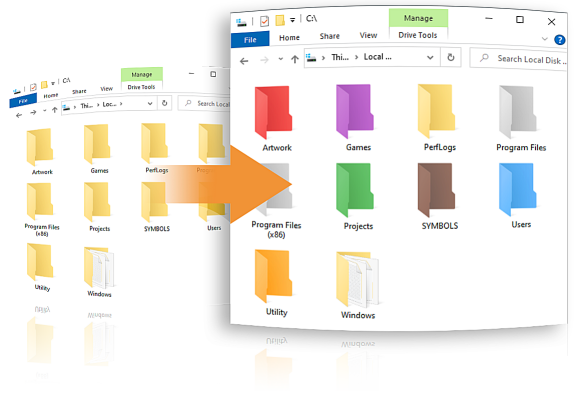
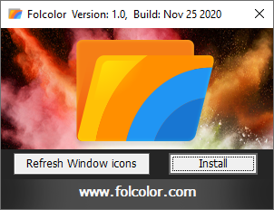
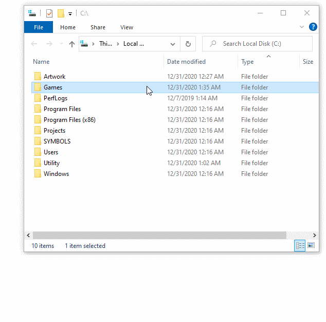

# Folcolor™: The Windows folder color utility
## Open Source, 100% free, minimalist, and secure.

 

### http://www.folcolor.com  

Coloring your Windows folders can help you organize and increase your productivity. Your folders are instantly recognizable by color vs having to pause to read their text label.  

Especially useful for programmers/developers, artists, power users, etc., that might have dozens of folders and multilevel nested folder trees to manage.  

### Latest release [download](https://github.com/kweatherman/Folcolor/releases/)

## Installing
1) Download the Folcolor.exe executable.  
2) Run Folcolor.exe and click the "Install" button.
 
### The dialog window
  

 
Now installed, simply right click on a folder, select "Color Folder", and select one of the 14 color selections.

## Features
* Selection of 14 colors based on the pleasant Google Material Design palette.  
* 100% Free Open Source. You can known what it's made of and freely modify, remove, or add features to it.  
* Minimalist, systems-level designed. Consists of a single executable with an embedded icons resource. Less than one megabyte size in total.  
* Secure design: Absolute minimal API usage, using zero network calls. No adware, no nag screens, data collection, and   doesn't use a vulnerable Explorer shell extension like others do.  

## Requirements  
Windows 7,8, or 10 32bit or 64bit OS.

## Motivation
After trying several commercial and free implementations of similar coloring tools, they were all lacking in one way or another.  Many had security red flags, advertising pop-ups, odd color schemes, using bloated Windows explorer shell Extensions, and/or with disagreeable license terms.  
I could see there really wasn't that much too them functionally so it was time to roll my own, make the better simpler one that I desired and then share with others.

See http://www.folcolor.com for more details.

## Bugs, Issues, Feature requests
Please report any potential bugs or other issues, suggestions, feature requests, using the github issue feautre.    
https://github.com/kweatherman/Folcolor/issues  

## Buliding
Developed in C/C++ using [Microsoft Visual Studio 2019](https://visualstudio.microsoft.com):  

Python 3.8 using the [PyCharm IDE](https://www.jetbrains.com/pycharm ) for procedurally generating the color icon sets.   

See http://www.folcolor.com for more development details.  

## Contributing
If you'd like to contribute, please fork the repository and use a feature
branch. Pull requests are welcomed.

## Licensing
The code and assets in this project is licensed under MIT license.  
Copyright (c) 2020 Kevin Weatherman  
https://github.com/kweatherman/Folcolor/blob/main/LICENSE

